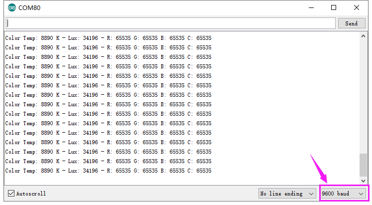

# Arduino


## 1. Arduino简介  

Arduino是一款开源电子原型平台，旨在为艺术家、设计师、爱好者和任何对创造性技术具有兴趣的人提供简单易用的硬件和软件工具。Arduino具有开放性，用户可以通过使用预先编写的代码库以及自己的代码进行快速开发。该平台支持多种编程语言，特别是Arduino C/C++，用户可以学习如何与传感器、执行器和项目组成部分进行交互。Arduino广泛应用于不同领域，例如学生的教育、产品原型设计以及个人项目开发，具有强大的功能和灵活性。  

## 2. 接线图  

  

## 3. 测试代码（测试软件版本：arduino-1.8.12）  

```cpp  
#include <Wire.h>  
#include "Adafruit_TCS34725.h"  

/* Example code for the Adafruit TCS34725 breakout library */  

/* Connect SCL to analog 5  
   Connect SDA to analog 4  
   Connect VDD to 3.3V DC  
   Connect GROUND to common ground */  

/* Initialise with specific int time and gain values */  
Adafruit_TCS34725 tcs = Adafruit_TCS34725(TCS34725_INTEGRATIONTIME_700MS, TCS34725_GAIN_1X);  

void setup(void) {  
    Serial.begin(9600);  
    if (tcs.begin()) {  
        Serial.println("Found sensor");  
    } else {  
        Serial.println("No TCS34725 found ... check your connections");  
        while (1);  
    }  
}  

void loop(void) {  
    uint16_t r, g, b, c, colorTemp, lux;  
    tcs.getRawData(&r, &g, &b, &c);  
    colorTemp = tcs.calculateColorTemperature(r, g, b);  
    lux = tcs.calculateLux(r, g, b);  
    
    Serial.print("Color Temp: "); Serial.print(colorTemp, DEC);  
    Serial.print(" K - ");  
    Serial.print("Lux: "); Serial.print(lux, DEC); Serial.print(" - ");  
    Serial.print("R: "); Serial.print(r, DEC); Serial.print(" ");  
    Serial.print("G: "); Serial.print(g, DEC); Serial.print(" ");  
    Serial.print("B: "); Serial.print(b, DEC); Serial.print(" ");  
    Serial.print("C: "); Serial.print(c, DEC);  
    Serial.println(" ");  
}  
```  

## 4. 代码说明  

1. 在该代码中，我们使用`Adafruit_TCS34725`库来读取颜色和光强信息。我们定义了传感器的连接和参数设置，以及如何输出颜色信息。  

2. `tcs.begin()`函数用来初始化传感器，如果传感器未找到，程序将输出提示信息，并进入无限循环。  

3. 在`loop`函数中，通过`tcs.getRawData()`函数读取红、绿、蓝和清晰度值，随后根据这些值计算色温和光照强度。  

4. 数据通过串口输出，助于我们观察传感器检测的颜色信息和光照强度。  

## 5. 测试结果  

按照接线图连接好设备，上传代码后，上电并打开串口监视器，设置波特率为9600，就可以看到检测物体的颜色（例如白色）的数据输出，如下图所示。  




