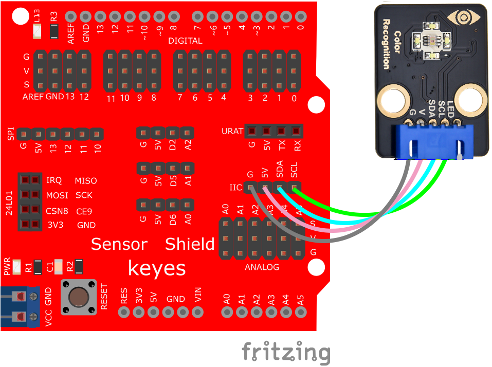
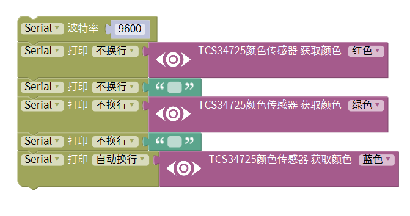
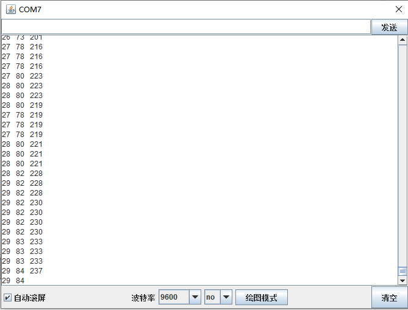

# Mixly

## 1. Mixly简介  

Mixly是一款基于图形化编程的开发环境，专为初学者和儿童设计。它通过简单的拖放式界面，使用户能够轻松创建Arduino项目，体验编程的乐趣。Mixly支持常见的编程语言，如Scratch和Arduino C，并提供丰富的库和模块，帮助用户实现多种功能和项目。用户可以利用Mixly进行传感器、灯光、马达等硬件控制，适合用于教育和创意项目。该平台不仅便于学习编程基础，还能激发用户的创造力和动手能力。  

## 2. 接线图  

  

## 3. 测试代码（测试软件版本：Mixly 1.2.0）  

  

## 4. 测试结果  

按照接线图连接好设备，上传代码并上电后，打开串口监视器，设置波特率为9600，就可以看到检测物体的颜色（例如白色）的数据输出，如下图所示。  

